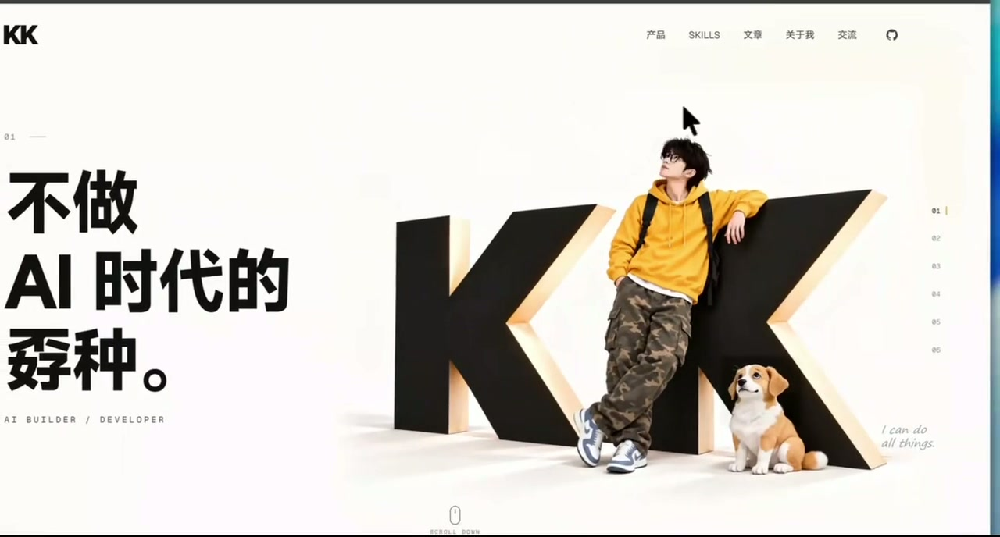

<div align="center">

# KK Head Follow

**让网页里的角色，跟着鼠标转头。**

连续视频 → 方向图集 → 网页交互

[实验版 0.1.0](VERSION) · [开始使用](#开始使用) · [制作流程](SKILL.md) · [效果视频](assets/readme/demo.mp4)

</div>

[](https://github.com/kkfor30/kk-head-follow/blob/main/assets/readme/demo.mp4)

<p align="center"><a href="https://github.com/kkfor30/kk-head-follow/blob/main/assets/readme/demo.mp4">▶ 观看 6 秒效果视频</a></p>

一个面向 AI 编程 Agent 的 Skill：从连续头部视频中识别方向、编译图集，并接入网页的鼠标跟随效果。适合个人主页、角色首屏和交互展示。

上方为维护者提供的实际效果录屏。它展示特定页面的体验，不是通用模板，也不代表任意输入素材都能一次成功。仓库不附带该页面的角色源图或生成原片。

## 它做什么

| 环节 | 能力 |
| --- | --- |
| 素材制作 | 复用已有视频；可选通过 ZenMux 生成动作小样 |
| 图集编译 | 标定真实方向，裁切、可选补帧、处理背景与 Alpha |
| 网页接入 | 四个原生 ES modules，将鼠标方向映射到已有姿态帧 |
| 质量检查 | 检查接缝、方向、轮廓与来源；未通过检查时保留静态图 |

每个主体需要独立标定。眼神动作来自视频本身，没有独立眼球控制。

## 开始使用

将仓库放入支持 `SKILL.md` 的 Agent 技能目录，目录名保留为 `kk-head-follow`。例如 Codex 的用户技能目录为 `~/.codex/skills/`；也可以先克隆，再让 Agent 读取本仓库的 `SKILL.md`：

```bash
git clone https://github.com/kkfor30/kk-head-follow.git
cd kk-head-follow
python -m pip install -r requirements.txt
```

运行环境：Python 3.10+、FFmpeg / FFprobe。配准与光流还需 `opencv-python-headless`；运行网页使用支持 ES modules 的现代浏览器，并通过 HTTP 提供页面。

对 Agent 说：

> 使用 $kk-head-follow，把我提供的连续头部视频接入现有网页，实现鼠标方向跟随。先检查视频是否覆盖完整方向，再交付可体验的候选并说明未通过的检查。

然后提供你的网页项目、底图、主体区域和输入视频。完整生产步骤见 [SKILL.md](SKILL.md)，浏览器接入见 [runtime.md](references/runtime.md)。

### 可选：生成动作视频

已有合适的视频可以跳过这一步。使用 ZenMux 时，通过隐藏输入配置自己的 API Key：

```bash
python scripts/zenmux_config.py set
```

Key 保存在用户配置目录，不写入仓库。新生成需要明确预算；默认从一次 5 秒小样开始。参数与输入要求见 [生成指南](references/zenmux.md) 和 [示例配置](references/zenmux.example.json)。示例需要替换为真实素材与检查记录，不能直接作为即用 Demo。

## 从视频到交互

1. **检查动作**：识别视频真实覆盖的方向，标出缺失、停留与反向。
2. **编译图集**：处理裁切、背景、采样与坐标，保留帧来源。
3. **在页面体验**：先进入诊断预览，检查顺逆方向、接缝、缩放与遮挡。
4. **通过检查后启用**：质量记录绑定当前素材；素材变化后重新检查。

“生成完成”“页面能动”“工程检查通过”“用户验收通过”是不同状态。详细合同见 [素材与坐标](references/asset-contract.md)、[质量与修复](references/repair-and-review.md)。

## 当前边界

- **实验版**：需要逐帧检查与实际页面验收，不承诺一次生成成功。
- **不包含自然回正系统**：鼠标进入中性区或移出时显示静态底图；自然进入、退出需要额外过渡素材。
- **方向缺失不能靠标签补齐**：完整方向环必须有对应动作证据。
- **复杂背景需要单独处理**：羽化不能消除内部色差、旧头轮廓或遮挡问题。

更多说明见 [版本范围](references/frozen-scope.md)。

## 开发与贡献

```bash
python -m pip install -r requirements-dev.txt
python -m unittest discover -s scripts -p "test_*.py"
node --test tests/*.test.mjs
```

测试验证工程行为，不代替视觉验收。提交问题时请说明复现步骤和环境；仅附可公开的素材，勿提交 Key、签名媒体链接、配置文件或私人项目记录。

[贡献说明](CONTRIBUTING.md) · [安全问题](SECURITY.md) · [更新记录](CHANGELOG.md)

## 许可

代码与文档的许可证见 [LICENSE](LICENSE)。演示媒体的使用说明见 [媒体说明](assets/readme/NOTICE.md)。
