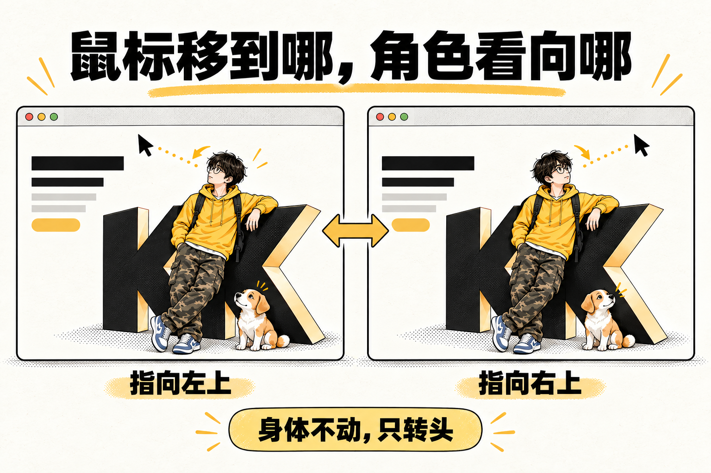

# KK Head Follow

让网页里的角色跟着鼠标转头。这个 Agent Skill 将连续头部视频整理成方向图集，再接入个人主页、角色首屏或交互展示。



## 演示

https://github.com/user-attachments/assets/83d29722-03d3-45ca-bc54-2e1e39bb6875

6 秒实际网页录屏；上方插画用于解释原理。仓库不包含演示中的角色源图和生成原片。

## 开始使用

把这句话发给支持 Skill 的 Agent：

```text
请从 https://github.com/kkfor30/kk-head-follow 安装 kk-head-follow，
遵循本机技能目录约定，并检查运行依赖。
```

安装后，提供网页项目、底图、主体区域和视频，再说：

```text
使用 $kk-head-follow，把这段头部视频接入网页，实现鼠标方向跟随。
先检查视频是否覆盖所需方向，再制作图集和可体验的页面。
```

需要 **Python 3.10+、FFmpeg / FFprobe**；配准和光流另需 `opencv-python-headless`。网页通过 HTTP 运行，浏览器需支持 ES modules。

<details>
<summary>手动安装</summary>

```bash
git clone https://github.com/kkfor30/kk-head-follow.git
cd kk-head-follow
python -m pip install -r requirements.txt
```

将完整目录安装到宿主的技能目录，或让 Agent 读取其中的 [SKILL.md](SKILL.md)。已配置共享技能库时，使用本机管理入口。

</details>

## 制作流程

1. **检查视频**：识别真实方向，找出缺失、停顿和反向动作。
2. **制作图集**：先用少量帧检查背景融合，再裁切、处理透明度和打包。
3. **接入网页**：将鼠标方向映射到已有姿态，检查接缝、缩放和遮挡；未通过检查时保留静态图。

只有静态图时，可先生成动作小样。使用 ZenMux 前，在 Skill 目录运行 `python scripts/zenmux_config.py set` 配置 Key，并确定生成预算。Key 保存在用户配置目录，不写入仓库；已有合适视频无需调用生成服务。

[可行性判断](references/feasibility.md) · [视频生成](references/zenmux.md) · [生成规划](references/generation-planning.md) · [提示词配方](references/prompt-patterns.md) · [网页接入](references/runtime.md)

## 使用边界

- 跟随效果取决于视频实际覆盖的方向，缺失动作不能靠改标签补齐；生成视频仍需检查身份和动作。
- 每个角色独立制作、标定。眼神已包含在视频里，不支持独立眼球控制或同方向不同距离的精确注视。
- 鼠标进入中性区或移出时显示静态底图；自然进入、退出和回正需要额外过渡素材。
- 复杂背景、色差和遮挡需要单独处理。实验候选可预览，但工程检查通过不代表视觉验收通过。

[头部与眼神](references/gaze-and-rest.md) · [场景处理](references/scene-routing.md) · [质量与修复](references/repair-and-review.md) · [版本范围](references/frozen-scope.md)

## 开发与贡献

```bash
python -m pip install -r requirements-dev.txt
python -m unittest discover -s scripts -p "test_*.py"
node --test tests/*.test.mjs
```

反馈时附环境和复现步骤，仅提供可公开的素材。测试不代替实际页面的视觉验收。

[贡献说明](CONTRIBUTING.md) · [安全问题](SECURITY.md) · [更新记录](CHANGELOG.md)

## 许可

代码与文档采用 [MIT License](LICENSE)。演示媒体见 [媒体说明](assets/readme/NOTICE.md)。
